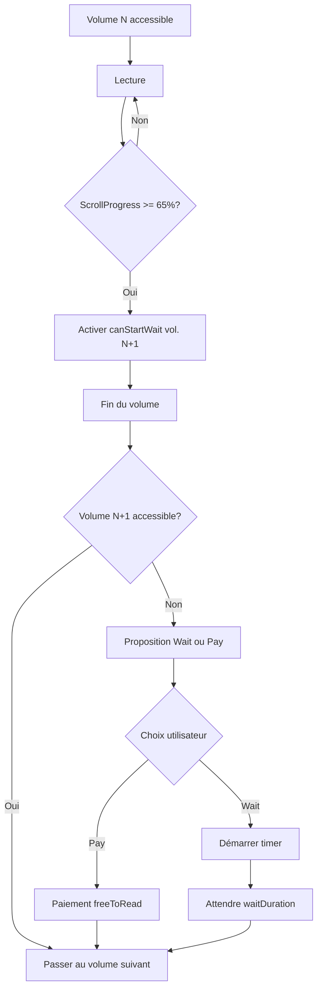
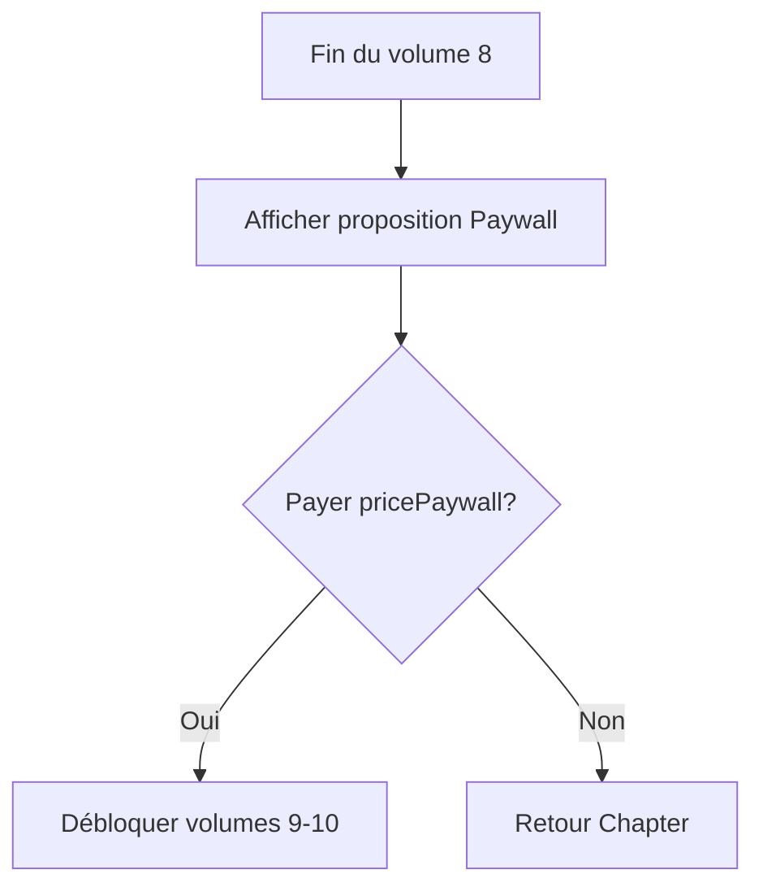
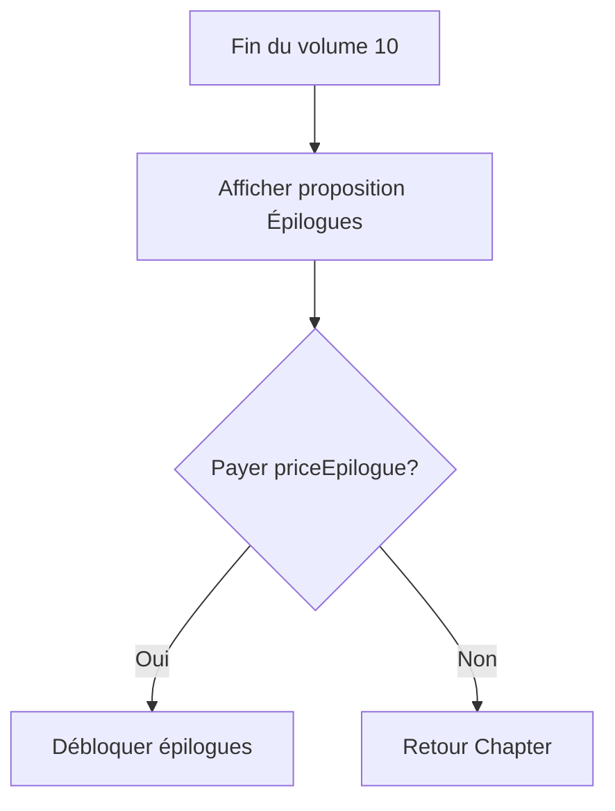

# Règles d'Accessibilité des Volumes

## 📋 Vue d'ensemble

Ce document définit les règles complètes d'accessibilité des volumes pour le système Cher Journal.

---

## 🚫 Règle 0 : Publication

**Si `status != "PUBLISHED"`** → Le volume n'existe pas côté client
- N'apparaît pas dans l'interface
- N'est pas retourné par l'API

---

## ✅ Règles d'accessibilité (status = PUBLISHED)

### Variable `isAccessible`

`isAccessible` est une variable **dynamique** calculée backend qui détermine si l'utilisateur peut lire le volume.

### Hiérarchie de déblocage

#### 1. **Achat complet du chapitre ou bundle**
```
Si (bundle contenant le chapitre ACHETÉ) OU (chapitre ACHETÉ)
→ Tous les volumes du chapitre sont accessibles
→ isAccessible = true pour tous
```

#### 2. **Volume gratuit (isFree)**
```
Si volume.isFree = true
→ isAccessible = true (accès immédiat, pas de wait)
```

#### 3. **Volumes 1-8 : Système Wait-to-Read**
```
Pour volumeNumber 1 à 8 :

Si (achat freeToRead du volume) OU (wait timer terminé)
→ isAccessible = true

Sinon
→ isAccessible = false
→ Retourner info : { type: 'WAIT_OR_PAY', waitRemaining: X, priceFreeToRead: Y }
```

#### 4. **Volumes 9-10 : Paywall**
```
Pour volumeNumber 9 et 10 :

Si (pricePaywall du chapitre PAYÉ)
→ isAccessible = true

Sinon
→ isAccessible = false
→ Retourner info : { type: 'PAYWALL', pricePaywall: X }
```

#### 5. **Volumes 11+ : Épilogues**
```
Pour volumeNumber >= 11 :

Si (priceEpilogue du chapitre PAYÉ)
→ isAccessible = true

Sinon
→ isAccessible = false
→ Retourner info : { type: 'EPILOGUE', priceEpilogue: X }
```

---

## 🎯 Système canStartWait

### Déclenchement (65% de lecture)

Dans le **Reader**, quand `scrollProgress >= 65%` :
1. Envoi requête API pour activer `canStartWait` du volume suivant
2. Enregistrement de `canStartWaitFrom = Date.now()`
3. Limite : **Volume 1-7 uniquement** (pour débloquer vol. 2-8)

### Sécurité backend

```typescript
// Vérification avant d'autoriser canStartWait
const currentVolume = await getVolume(currentVolumeId);
const timeSinceStart = Date.now() - currentVolume.canStartWaitFrom;

if (timeSinceStart > waitDuration) {
  throw new Error('CANNOT_START_WAIT_YET');
}
```

### Calcul du temps restant

```typescript
const waitRemaining = (canStartWaitFrom + waitDuration) - Date.now();

if (waitRemaining <= 0) {
  isAccessible = true;
}
```

---

## 🎨 Affichage UI

### Dans Reader

#### Fin de volumes 1-7
Si `volumeNumber <= 7` ET `volume suivant isAccessible = false` :
```
┌─────────────────────────────────────┐
│ 🎉 Volume terminé !                 │
│                                      │
│ Envie de découvrir la suite ?       │
│                                      │
│ [Attendre gratuitement] [Débloquer] │
│    (24h restantes)      (€2.99)     │
└─────────────────────────────────────┘
```

#### Fin de volume 8
```
┌─────────────────────────────────────┐
│ 🔥 Volumes Premium                  │
│                                      │
│ Accédez aux volumes 9 et 10         │
│                                      │
│ [Débloquer €4.99]                   │
└─────────────────────────────────────┘
```

#### Fin de volume 10
```
┌─────────────────────────────────────┐
│ ✨ Épilogues Exclusifs              │
│                                      │
│ Découvrez les épilogues secrets     │
│                                      │
│ [Débloquer €3.99]                   │
└─────────────────────────────────────┘
```

### Dans Chapter

**Afficher uniquement les volumes `isAccessible = true`**

Après le dernier volume accessible :

```
┌─────────────────────────────────────────┐
│ Envie de plonger plus profondément ?    │
│                                          │
│ [Voir le Volume X pour €2.99]           │
│ 📅 Volume X disponible dans 12h 34min   │
└─────────────────────────────────────────┘

┌─────────────────────────────────────────┐
│ Aller plus loin...                      │
│                                          │
│ 📚 Acheter le chapitre complet - €19.99 │
│ 👤 Version de {{protagoniste}} - €9.99  │
│ 🎨 Cahier de coloriage - €7.99          │
│ 🔊 Version audio - Bientôt disponible   │
│ 📮 Abonnement papier - Bientôt          │
└─────────────────────────────────────────┘
```

---

## 🔐 Vérifications Backend

### Checklist pour `isAccessible`

```typescript
async function calculateIsAccessible(userId, volume) {
  // 1. Vérifier bundles
  const hasBundle = await checkUserHasBundle(userId, volume.chapterId);
  if (hasBundle) return true;

  // 2. Vérifier achat chapitre
  const hasChapter = await checkUserHasChapter(userId, volume.chapterId);
  if (hasChapter) return true;

  // 3. Vérifier isFree
  if (volume.isFree) return true;

  // 4. Volumes 1-8 : Wait-to-read ou freeToRead
  if (volume.volumeNumber <= 8) {
    const hasPaidFreeToRead = await checkPaidFreeToRead(userId, volume.id);
    if (hasPaidFreeToRead) return true;

    const waitUnlock = await getWaitUnlock(userId, volume.id);
    if (waitUnlock && waitUnlock.unlocksAt <= Date.now()) return true;

    return false;
  }

  // 5. Volumes 9-10 : Paywall
  if (volume.volumeNumber <= 10) {
    const hasPaidPaywall = await checkPaidPaywall(userId, volume.chapterId);
    return hasPaidPaywall;
  }

  // 6. Volumes 11+ : Épilogues
  const hasPaidEpilogue = await checkPaidEpilogue(userId, volume.chapterId);
  return hasPaidEpilogue;
}
```

---

## 📊 Types de blocage

```typescript
type BlockageInfo =
  | { type: 'WAIT_OR_PAY', waitRemaining: number, priceFreeToRead: number }
  | { type: 'PAYWALL', pricePaywall: number }
  | { type: 'EPILOGUE', priceEpilogue: number }
  | { type: 'BUNDLE_REQUIRED', bundles: Bundle[] }
```

---

## 🔄 Flux utilisateur

### Lecture normale (Volumes 1-8)



### Accès Paywall (Volumes 9-10)



### Accès Épilogues (Volumes 11+)



---

## ⚠️ Notes importantes

1. **Toutes les vérifications sont côté backend** - Ne jamais faire confiance au frontend
2. **Prix dynamiques** - Toujours vérifier price_schemas et promotions
3. **Sécurité canStartWait** - Empêcher activation manuelle/hack
4. **Volumes non publiés** - Jamais exposés côté API
5. **Order de priorité** : Bundle > Chapter > isFree > freeToRead > Paywall > Epilogue
